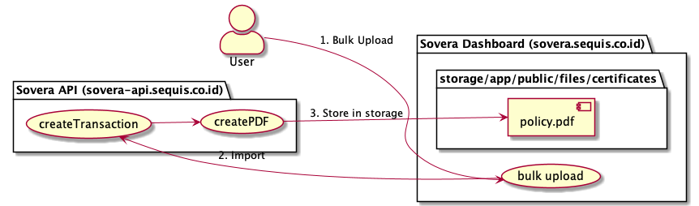
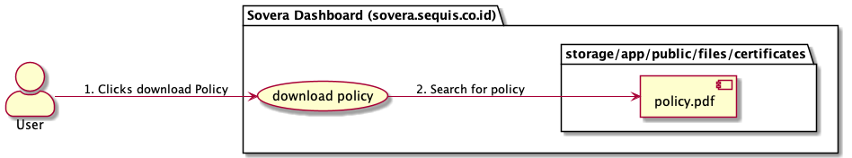

## Note for Bulk Download Process ##


### Current Bulk Upload Process ###


1. User will log in to sovera-dashboard and then upload the file through Bulk Upload
2. The file will be handled by sovera-dashboard and will hit sovera-api for the create Transaction
3. After the sovera-api finishes the creation of policy, it will store the created policy to the storage folder in sovera-dashboard

### Current Download Policy Process ###


1. User will download the policy from Transaction Detail page by clicking the "download policy" button
2. It will search the desired policy in the storage folder
3. If it exists, then the file will be downloaded


### Base Architecture ###
- sovera.sequis.co.id

```
Folder sovera.sequis.co.id (dashboard, not the API)
.
|
└── app                    
└── storage                 
    ├── app                 
        ├── public             
            ├── files             
                ├── certificates 
                    ├── aaa.pdf   #this is where the pdf would be stored
```         